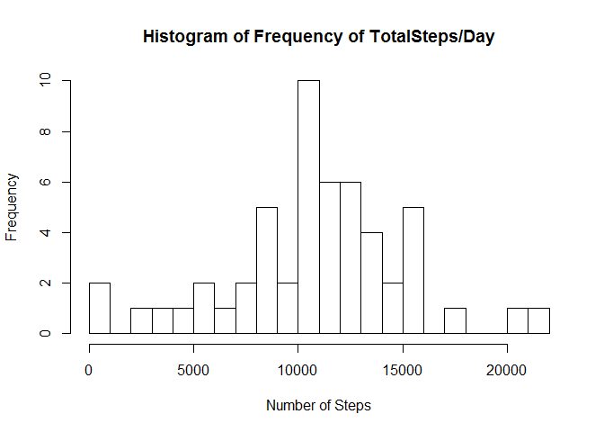
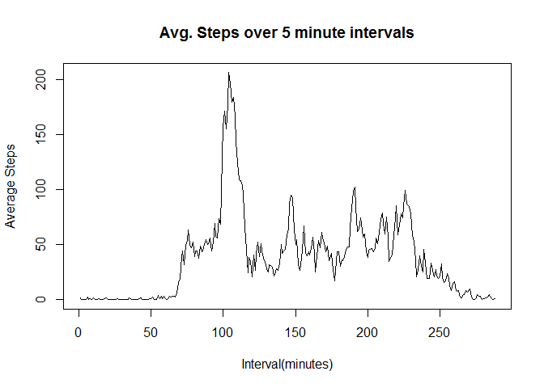
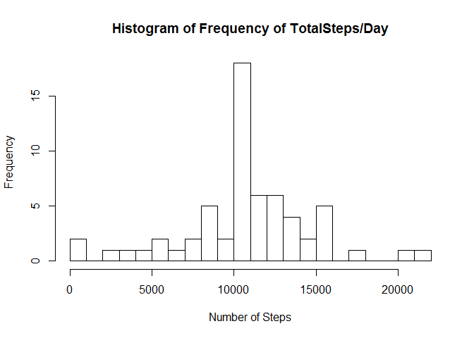

##Title: "Reproducible Research: Peer Assessment 1"
author: "Han Zhang"
date: "May 21, 2017"
output: html_document


## Loading and preprocessing the data

```r
data <- read.csv("activity.csv", header = TRUE, sep = ",", na.strings = "NA")
summary(data)
```

```
##      steps                date          interval     
##  Min.   :  0.00   2012-10-01:  288   Min.   :   0.0  
##  1st Qu.:  0.00   2012-10-02:  288   1st Qu.: 588.8  
##  Median :  0.00   2012-10-03:  288   Median :1177.5  
##  Mean   : 37.38   2012-10-04:  288   Mean   :1177.5  
##  3rd Qu.: 12.00   2012-10-05:  288   3rd Qu.:1766.2  
##  Max.   :806.00   2012-10-06:  288   Max.   :2355.0  
##  NA's   :2304     (Other)   :15840
```

```r
data$date <- as.Date(data$date, format = "%Y-%m-%d")
dataByDay <- split(data, data$date)
```


## What is mean total number of steps taken per day?


```r
    #Total number of steps/Median per day
    totalSteps <- sapply(dataByDay, function(x) sum(x$steps))
    meanSteps <- sapply(dataByDay, function(x) mean(x$steps))
    hist(totalSteps,main="Histogram of Frequency of TotalSteps/Day", breaks = 20, xlab = "Number of Steps")
```

<!-- -->

Total number of steps/day

```r
    totalSteps
```

```
## 2012-10-01 2012-10-02 2012-10-03 2012-10-04 2012-10-05 2012-10-06 
##         NA        126      11352      12116      13294      15420 
## 2012-10-07 2012-10-08 2012-10-09 2012-10-10 2012-10-11 2012-10-12 
##      11015         NA      12811       9900      10304      17382 
## 2012-10-13 2012-10-14 2012-10-15 2012-10-16 2012-10-17 2012-10-18 
##      12426      15098      10139      15084      13452      10056 
## 2012-10-19 2012-10-20 2012-10-21 2012-10-22 2012-10-23 2012-10-24 
##      11829      10395       8821      13460       8918       8355 
## 2012-10-25 2012-10-26 2012-10-27 2012-10-28 2012-10-29 2012-10-30 
##       2492       6778      10119      11458       5018       9819 
## 2012-10-31 2012-11-01 2012-11-02 2012-11-03 2012-11-04 2012-11-05 
##      15414         NA      10600      10571         NA      10439 
## 2012-11-06 2012-11-07 2012-11-08 2012-11-09 2012-11-10 2012-11-11 
##       8334      12883       3219         NA         NA      12608 
## 2012-11-12 2012-11-13 2012-11-14 2012-11-15 2012-11-16 2012-11-17 
##      10765       7336         NA         41       5441      14339 
## 2012-11-18 2012-11-19 2012-11-20 2012-11-21 2012-11-22 2012-11-23 
##      15110       8841       4472      12787      20427      21194 
## 2012-11-24 2012-11-25 2012-11-26 2012-11-27 2012-11-28 2012-11-29 
##      14478      11834      11162      13646      10183       7047 
## 2012-11-30 
##         NA
```
  
Mean of steps/day

```r
  meanSteps
```

```
## 2012-10-01 2012-10-02 2012-10-03 2012-10-04 2012-10-05 2012-10-06 
##         NA  0.4375000 39.4166667 42.0694444 46.1597222 53.5416667 
## 2012-10-07 2012-10-08 2012-10-09 2012-10-10 2012-10-11 2012-10-12 
## 38.2465278         NA 44.4826389 34.3750000 35.7777778 60.3541667 
## 2012-10-13 2012-10-14 2012-10-15 2012-10-16 2012-10-17 2012-10-18 
## 43.1458333 52.4236111 35.2048611 52.3750000 46.7083333 34.9166667 
## 2012-10-19 2012-10-20 2012-10-21 2012-10-22 2012-10-23 2012-10-24 
## 41.0729167 36.0937500 30.6284722 46.7361111 30.9652778 29.0104167 
## 2012-10-25 2012-10-26 2012-10-27 2012-10-28 2012-10-29 2012-10-30 
##  8.6527778 23.5347222 35.1354167 39.7847222 17.4236111 34.0937500 
## 2012-10-31 2012-11-01 2012-11-02 2012-11-03 2012-11-04 2012-11-05 
## 53.5208333         NA 36.8055556 36.7048611         NA 36.2465278 
## 2012-11-06 2012-11-07 2012-11-08 2012-11-09 2012-11-10 2012-11-11 
## 28.9375000 44.7326389 11.1770833         NA         NA 43.7777778 
## 2012-11-12 2012-11-13 2012-11-14 2012-11-15 2012-11-16 2012-11-17 
## 37.3784722 25.4722222         NA  0.1423611 18.8923611 49.7881944 
## 2012-11-18 2012-11-19 2012-11-20 2012-11-21 2012-11-22 2012-11-23 
## 52.4652778 30.6979167 15.5277778 44.3993056 70.9270833 73.5902778 
## 2012-11-24 2012-11-25 2012-11-26 2012-11-27 2012-11-28 2012-11-29 
## 50.2708333 41.0902778 38.7569444 47.3819444 35.3576389 24.4687500 
## 2012-11-30 
##         NA
```


## What is the average daily activity pattern?

```r
    steps_per_interval <- tapply(data$steps, data$interval, mean, na.rm = T)
    steps_per_interval <- data.frame(names(steps_per_interval), steps_per_interval)
    colnames(steps_per_interval) <- c("interval", "average_steps")

    #Plots the avgsteps vs time interval
    plot(steps_per_interval$average_steps, type='l', main='Avg. Steps over 5 minute intervals',xlab='Interval(minutes)',
     ylab='Average Steps')
```

<!-- -->

```r
    #Finds the interval with the highest avg
    max_steps <- max(steps_per_interval$average_steps, na.rm = T)
    max_steps
```

```
## [1] 206.1698
```

```r
    intervale_max_steps<-steps_per_interval[which.max(steps_per_interval$average_steps),]$interval
    intervale_max_steps
```

```
## [1] 835
## 288 Levels: 0 10 100 1000 1005 1010 1015 1020 1025 1030 1035 1040 ... 955
```


## Imputing missing values

```r
    sum(is.na(as.character(data$steps)))
```

```
## [1] 2304
```

```r
    sum(is.na(as.character(data$date)))
```

```
## [1] 0
```

```r
    sum(is.na(as.character(data$interval)))
```

```
## [1] 0
```


The number of NA values in the dataset is 2304

###Code to describe and show a strategy for imputing missing data


```r
    NA_index <- which(is.na(as.character(data$steps)))
    complete_data <- data
    complete_data[NA_index, ]$steps<-unlist(lapply(NA_index, FUN=function(NA_index){
      steps_per_interval[data[NA_index,]$interval==steps_per_interval$interval,]$average_steps}))

    summary(complete_data)
```

```
##      steps             date               interval     
##  Min.   :  0.00   Min.   :2012-10-01   Min.   :   0.0  
##  1st Qu.:  0.00   1st Qu.:2012-10-16   1st Qu.: 588.8  
##  Median :  0.00   Median :2012-10-31   Median :1177.5  
##  Mean   : 37.38   Mean   :2012-10-31   Mean   :1177.5  
##  3rd Qu.: 27.00   3rd Qu.:2012-11-15   3rd Qu.:1766.2  
##  Max.   :806.00   Max.   :2012-11-30   Max.   :2355.0
```

###Code to describe and show a strategy for imputing missing data


```r
    NA_index <- which(is.na(as.character(data$steps)))
    complete_data <- data
    complete_data[NA_index, ]$steps<-unlist(lapply(NA_index, FUN=function(NA_index){
      steps_per_interval[data[NA_index,]$interval==steps_per_interval$interval,]$average_steps}))

    summary(complete_data)
```

```
##      steps             date               interval     
##  Min.   :  0.00   Min.   :2012-10-01   Min.   :   0.0  
##  1st Qu.:  0.00   1st Qu.:2012-10-16   1st Qu.: 588.8  
##  Median :  0.00   Median :2012-10-31   Median :1177.5  
##  Mean   : 37.38   Mean   :2012-10-31   Mean   :1177.5  
##  3rd Qu.: 27.00   3rd Qu.:2012-11-15   3rd Qu.:1766.2  
##  Max.   :806.00   Max.   :2012-11-30   Max.   :2355.0
```

```r
    str(complete_data)
```

```
## 'data.frame':	17568 obs. of  3 variables:
##  $ steps   : num  1.717 0.3396 0.1321 0.1509 0.0755 ...
##  $ date    : Date, format: "2012-10-01" "2012-10-01" ...
##  $ interval: int  0 5 10 15 20 25 30 35 40 45 ...
```

###Making a histogram of the total number of steps taken each day for the complete dataset:


```r
    dataByDayComplete <- split(complete_data, complete_data$date)
    totalStepsComplete <- sapply(dataByDayComplete , function(x) sum(x$steps))
    meanStepsComplete  <- sapply(dataByDayComplete , function(x) mean(x$steps))
    
    hist(totalStepsComplete ,main="Histogram of Frequency of TotalSteps/Day", breaks = 20, xlab = "Number of Steps")
```

<!-- -->


## Are there differences in activity patterns between weekdays and weekends?


```r
    complete_data$day <- as.factor(weekdays(complete_data$date))
    complete_data$is_weekday <- ifelse(!(complete_data$day %in% c("Saturday","Sunday")), TRUE, FALSE) 

    weekdays_data <- complete_data[complete_data$is_weekday,]
    steps_per_interval_weekdays <- aggregate(weekdays_data$steps, by=list(interval=weekdays_data$interval), FUN=mean)

    weekends_data <- complete_data[!complete_data$is_weekday,]
    steps_per_interval_weekends <- aggregate(weekends_data$steps, by=list(interval=weekends_data$interval), FUN=mean)

    colnames(steps_per_interval_weekdays) <- c("interval", "average_steps")
    colnames(steps_per_interval_weekends) <- c("interval", "average_steps")
    steps_per_interval_weekdays$day <- "Weekday"
    steps_per_interval_weekends$day <- "Weekend"

    week_data <- rbind(steps_per_interval_weekends, steps_per_interval_weekdays)
    week_data$day <- as.factor(week_data$day)

    library(lattice)
    xyplot(average_steps ~  interval | day, data = week_data, layout = c(1,2), type ="l", ylab="Number of Steps")
```

<!-- -->

